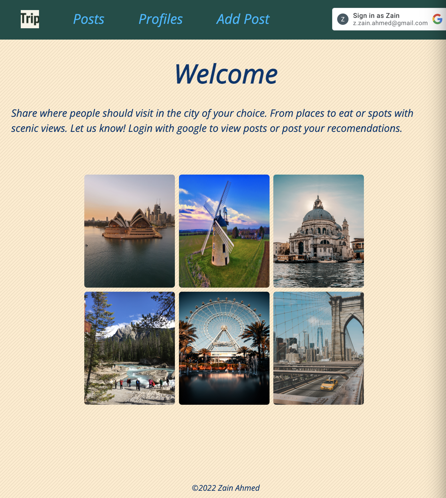

# Trip-collector

## Description
I thought it would be fun to have a place to save all the bits information you hear about what do see when you travel. Thats where Trip comes in. Its a just that place. Users can share their experience and record places that they want to gos see. The best part is that your able to see everyones posts so you have accesses to places you may not have found on your lone searches. Use Trip to plan you next outing or vacation.

## Getting Started
Simply loggin with your google account and start posting about places you have been to or want to go to. Or just scroool through previous posts to 

[Trip](https://zainahmed-trip-collector.fly.dev/)

[Planning Material](https://trello.com/b/gapWl0O7/trip-collector-board)

## Landing Page

---

## Technologies Used
- EJS, CSS, Javascript, Mongoose, Express, MongoDB, Bootstrap, GoogleOAuth

## Next Steps
-Add functionally to veiw and sort page by city
-add search bar feature
-responsive design

## Credits
-Unsplash
-Google Fonts